# BigQuery SQL Generator with AI (ADK BigQuery Tools)

This application allows you to interact with your Google BigQuery database using natural language queries. The AI agent translates your questions into SQL queries and executes them against your BigQuery dataset using Google ADK BigQuery tools for simplified database interactions.

## Architecture

The application follows a simplified architecture with Google ADK BigQuery tools for database interactions:

- **View**: Streamlit frontend
- **Controller**: SQL generation agent
- **Model**: BigQuery client with Google ADK BigQuery tools integration

## System Design

```mermaid
graph TD
    %% User Interface Layer %%
    User[👨‍💼 User] --> |Asks questions in natural language| WebApp[📱 Streamlit Web App<br/>main.py]
    
    %% Application Layer %%
    WebApp --> |Sends user query| SQLAgent[🤖 SQL Generation Agent<br/>sql_generation_agent.py]
    WebApp --> |Requests data operations| DBClient[🔌 BigQuery Client<br/>mcp_client.py]
    
    %% AI Processing %%
    SQLAgent --> |Uses LLM| Gemini[(🧠 Google Gemini<br/>via LangChain)]
    SQLAgent --> |Parses structured output| Models[📋 Data Models<br/>models.py]
    
    %% Configuration %%
    Config[⚙️ Configuration<br/>config.py] --> SQLAgent
    Config --> DBClient
    EnvVars[🔑 Environment Variables<br/>.env] --> Config
    
    %% Database Layer %%
    DBClient --> |Executes queries| BQTools[🔧 BigQuery Tools<br/>bigquery_tools.py]
    BQTools --> |Connects securely| BigQuery[(☁️ Google BigQuery)]
    
    %% Security & Configuration %%
    ADKConfig[🛡️ ADK Configuration<br/>adk_config.py] --> BQTools
    BigQuery --> |Returns data| DBClient
    DBClient --> |Returns results| WebApp
    
    %% Data Flow Annotations %%
    linkStyle 0 stroke:#4CAF50,stroke-width:2px
    linkStyle 1 stroke:#2196F3,stroke-width:2px
    linkStyle 2 stroke:#FF9800,stroke-width:2px
    linkStyle 3 stroke:#9C27B0,stroke-width:2px
    linkStyle 4 stroke:#607D8B,stroke-width:2px
    linkStyle 5 stroke:#795548,stroke-width:2px
    linkStyle 6 stroke:#E91E63,stroke-width:2px
    linkStyle 7 stroke:#FF5722,stroke-width:2px
    linkStyle 8 stroke:#3F51B5,stroke-width:2px
    
    %% Component Styling %%
    style User fill:#E3F2FD,stroke:#1976D2,stroke-width:2px
    style WebApp fill:#E8F5E9,stroke:#388E3C,stroke-width:2px
    style SQLAgent fill:#FFF3E0,stroke:#F57C00,stroke-width:2px
    style Gemini fill:#F3E5F5,stroke:#7B1FA2,stroke-width:2px
    style Models fill:#E1F5FE,stroke:#0288D1,stroke-width:2px
    style Config fill:#FBE9E7,stroke:#DD2C00,stroke-width:2px
    style EnvVars fill:#E0F2F1,stroke:#00796B,stroke-width:2px
    style DBClient fill:#E0F7FA,stroke:#0097A7,stroke-width:2px
    style BQTools fill:#F1F8E9,stroke:#689F38,stroke-width:2px
    style BigQuery fill:#FFF8E1,stroke:#FF8F00,stroke-width:2px
    style ADKConfig fill:#E8EAF6,stroke:#303F9F,stroke-width:2px
    
    %% Legend %%
    subgraph Legend[Legend]
        direction LR
        L1[📱 = User Interface Component]
        L2[🤖 = AI/Processing Component]
        L3[☁️ = External Service]
        L4[🔐 = Security/Configuration]
        L5[📋 = Data Structure]
    end
    
    style L1 fill:#E8F5E9,stroke:#388E3C,stroke-width:1px
    style L2 fill:#FFF3E0,stroke:#F57C00,stroke-width:1px
    style L3 fill:#FFF8E1,stroke:#FF8F00,stroke-width:1px
    style L4 fill:#E8EAF6,stroke:#303F9F,stroke-width:1px
    style L5 fill:#E1F5FE,stroke:#0288D1,stroke-width:1px
```



## 🔄 Data Flow Process

1. **User Input**: User asks a question in natural language
2. **AI Processing**: SQL Agent converts the question to SQL using the configured LLM
3. **Validation**: BigQuery Client validates the generated SQL
4. **Execution**: BigQuery Tools execute the query against BigQuery
5. **Results**: Data is returned and displayed to the user

This architecture ensures a clean separation of concerns, security through configuration, and a smooth user experience for natural language database querying.

## Setup

1. **Create a virtual environment:**
   ```bash
   python3 -m venv .venv
   ```

2. **Activate the virtual environment:**
   ```bash
   source .venv/bin/activate
   ```

3. **Install dependencies:**
   ```bash
   pip install -r requirements.txt
   ```

4. **Configure environment variables:**
   Copy the `.env.example` file to `.env` and set your actual values:
   ```bash
   cp .env.example .env
   ```
   
   Then edit the `.env` file with your configuration:
   - Set your Google Cloud project ID and dataset ID
   - Choose your LLM provider (`google` or `openai`)
   - Set your model name (e.g., `gemini-2.5-flash` or `gpt-4-turbo`)
   - Add your API key for the chosen provider
   - Adjust other settings as needed

5. **Authenticate with Google Cloud:**
   Make sure you've authenticated with Google Cloud:
   ```bash
   gcloud auth application-default login
   ```

## Usage

1. **Activate the virtual environment:**
   ```bash
   source .venv/bin/activate
   ```

2. **Run the application:**
   ```bash
   streamlit run main.py
   ```

3. **Open your browser:**
   Visit `http://localhost:8501` to access the application.

4. **Ask questions:**
   Type your questions about the data in the chat input and the AI agent will generate and execute SQL queries using Google ADK BigQuery tools.

## Configuration

All configuration is managed through environment variables in the `.env` file:

- `PROJECT_ID`: Your Google Cloud project ID
- `DATASET_ID`: Your BigQuery dataset ID
- `LLM_PROVIDER`: The LLM provider to use (`google` or `openai`)
- `MODEL_NAME`: The specific model to use (e.g., `gemini-2.5-flash` or `gpt-4-turbo`)
- `TEMPERATURE`: The temperature setting for the LLM (default: 0)
- `GEMINI_API_KEY`: Your Gemini API key (if using Google)
- `OPENAI_API_KEY`: Your OpenAI API key (if using OpenAI)
- `SCHEMA_CACHE_TTL`: How long to cache the database schema (in seconds, default: 3600)

## LLM Providers

The application supports multiple LLM providers:

### Google Gemini
- Set `LLM_PROVIDER=google`
- Set `MODEL_NAME` to a Gemini model (e.g., `gemini-2.5-flash`)
- Add your `GEMINI_API_KEY`

### OpenAI
- Set `LLM_PROVIDER=openai`
- Set `MODEL_NAME` to an OpenAI model (e.g., `gpt-4-turbo`)
- Add your `OPENAI_API_KEY`

## Google ADK BigQuery Tools

This application uses Google ADK (Application Development Kit) BigQuery tools for database interactions, which provides:

- Simplified BigQuery operations through built-in toolset
- Built-in security features with write protection
- Context-aware query execution
- Error handling and logging

The BigQueryToolset is configured with WriteMode.BLOCKED to prevent destructive operations.

## File Structure

- `main.py` - Entry point for the Streamlit application
- `sql_generation_agent.py` - AI agent that generates SQL queries from natural language
- `mcp_client.py` - BigQuery client with ADK BigQuery tools integration
- `bigquery_tools.py` - BigQuery tools leveraging ADK BigQuery tools
- `adk_config.py` - Configuration for Google ADK tools
- `config.py` - Configuration management
- `models.py` - Data models
- `requirements.txt` - Python dependencies
- `.env` - Environment variables (create from `.env.example`)